# ERA Integrated Project Management System (ERA-IPMS)

# System Workflows

## Document Information

**Project:** ERA Integrated Project Management System (ERA-IPMS)
**Document Type:** System Workflow Design
**Version:** 1.1
**Date:** September 2026
**Prepared By:** Abdullahi Abdi Mohamed

# 1. Introduction

This document defines the principal operational workflows for ERA-IPMS.

A workflow describes how information, responsibilities, decisions, and records move through the system from initiation to completion.

The workflows cover:

* Authentication and access control.
* Beneficiary registration.
* Disability assessment.
* Home visits.
* Referrals.
* Referral follow-ups.
* Projects.
* Activities.
* Poultry.
* Poultry stock.
* Egg production.
* Poultry feed.
* Poultry health.
* Small farm activities.
* Farm harvests.
* Farm-to-poultry transfers.
* Finance.
* Staff and Members.
* Monitoring and evaluation.
* Dashboards.
* Reporting.
* Search and filtering.
* Notifications.
* Record correction.
* Data validation.
* Beneficiary archiving.
* Audit information.

The diagrams in this document use Mermaid flowcharts. Rounded shapes represent process entry or completion, rectangles represent actions, diamonds represent decisions, and database shapes represent stored information.

# 2. Workflow Design Principles

ERA-IPMS workflows shall follow these principles:

1. **Simple:** Users should not complete unnecessary steps.
2. **Accurate:** Important information must be validated.
3. **Traceable:** Important actions should identify the responsible user.
4. **Secure:** Access must follow permissions and record-level rules.
5. **Practical:** Workflows should reflect actual ERA operations.
6. **Accountable:** Approval actions must be separated from ordinary data entry where required.
7. **Expandable:** Future requirements should be accommodated without redesigning the entire system.
8. **Consistent:** The same business rule should not behave differently between modules.

# 3. Access Control Model

Before a protected workflow begins, the system determines whether the user is authorised.

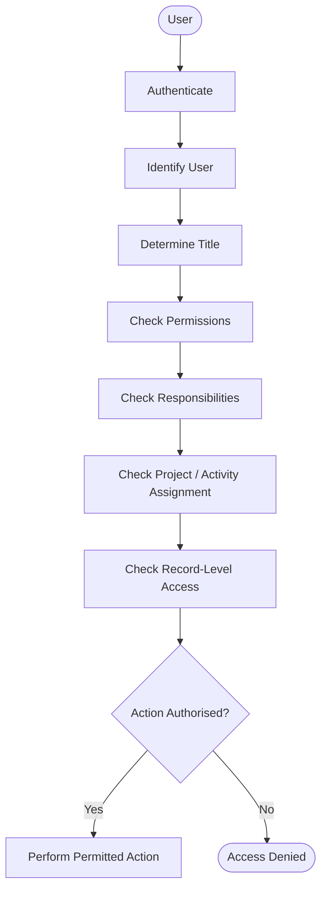

The access model is enforced by the backend.

Hiding a button or menu item in the interface is not sufficient security.

# 4. User Login Workflow

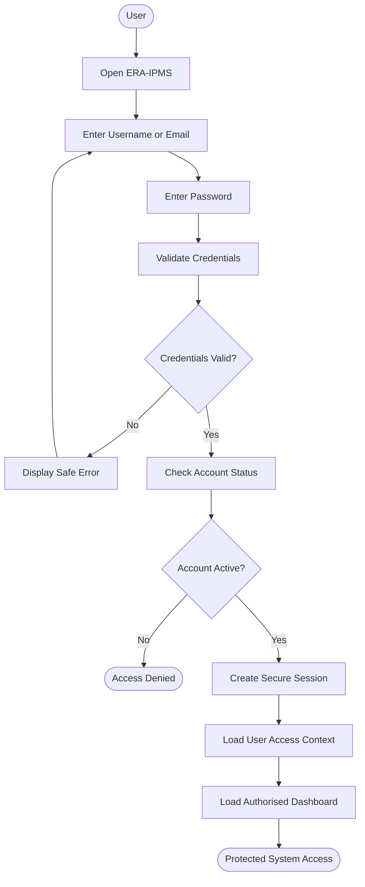

## Rules

* Login supports username or email.
* Incorrect credentials must not reveal sensitive authentication information.
* Inactive users must not authenticate.
* Successful authentication creates a secure session.
* User permissions and responsibilities determine subsequent access.
* Logout must invalidate the authenticated session.

# 5. Beneficiary Search and Registration Workflow

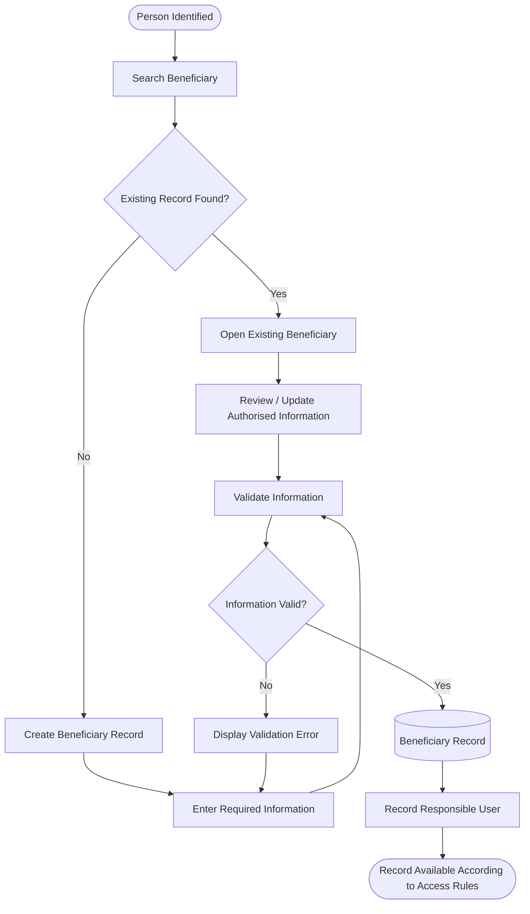

## Rules

* Users must search before creating a new beneficiary.
* Duplicate detection should be performed where practical.
* Required information must be validated.
* The user creating the record should be recorded.
* Access must respect beneficiary record-level permissions.

# 6. Disability Assessment Workflow

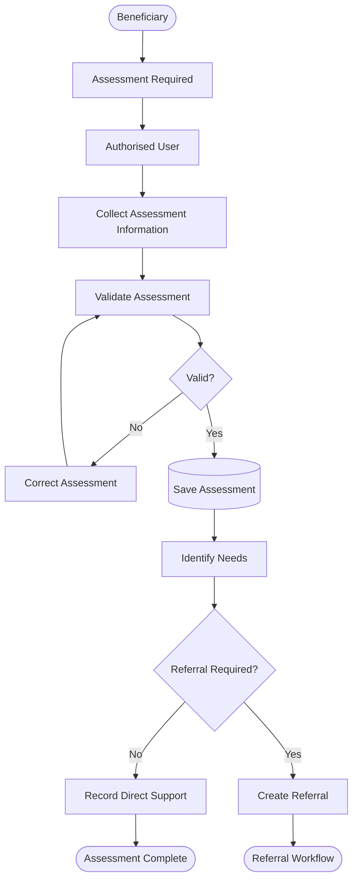

# 7. Home Visit Workflow

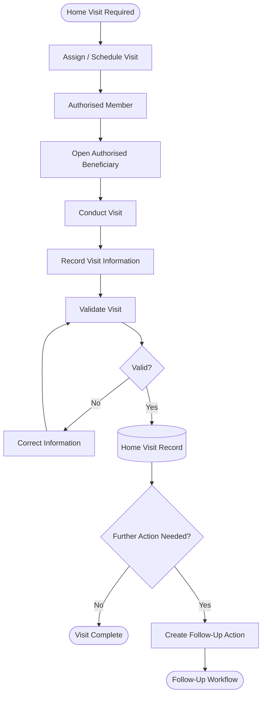

A home visit record may include the beneficiary, visit date, responsible person, purpose, observations, support provided, follow-up requirement, next action, and outcome.

# 8. Referral Creation and Submission Workflow

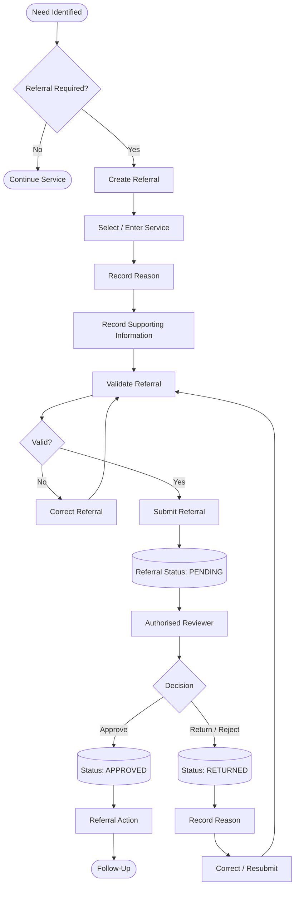

Creating a referral and approving a referral are separate actions.

# 9. Referral Follow-Up Workflow

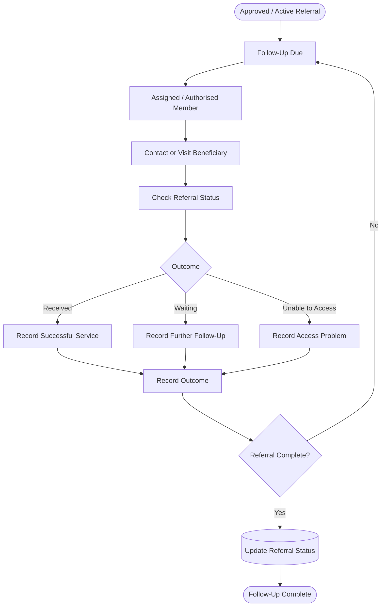

Possible referral statuses include:

* Pending
* Submitted
* Approved
* In Progress
* Completed
* Returned
* Cancelled
* Closed

The final status vocabulary shall be confirmed during database design.

# 10. Project Creation Workflow

Project creation is initially authorised for Admin and Director according to their assigned permissions.

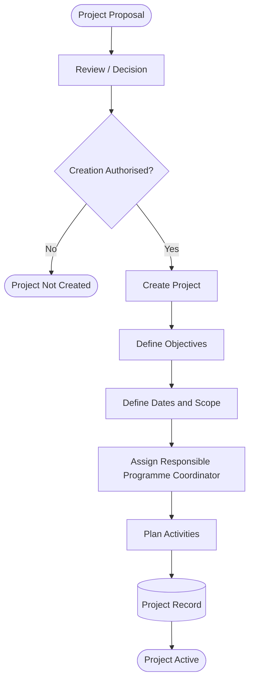

# 11. Project Management Workflow

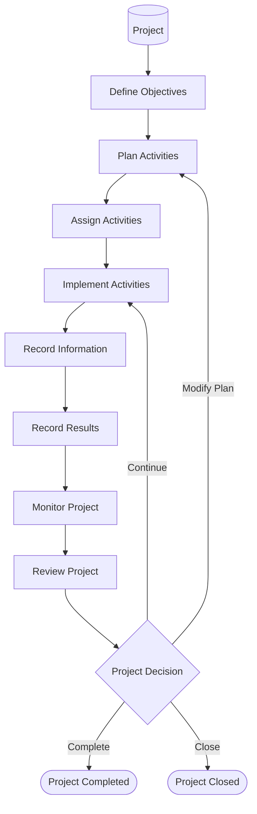

# 12. Activity Workflow

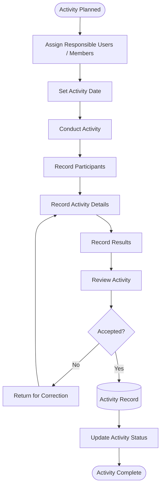

Initial activity statuses:

* Planned
* Ongoing
* Pending
* Completed
* Cancelled

# 13. Activity Assignment Workflow

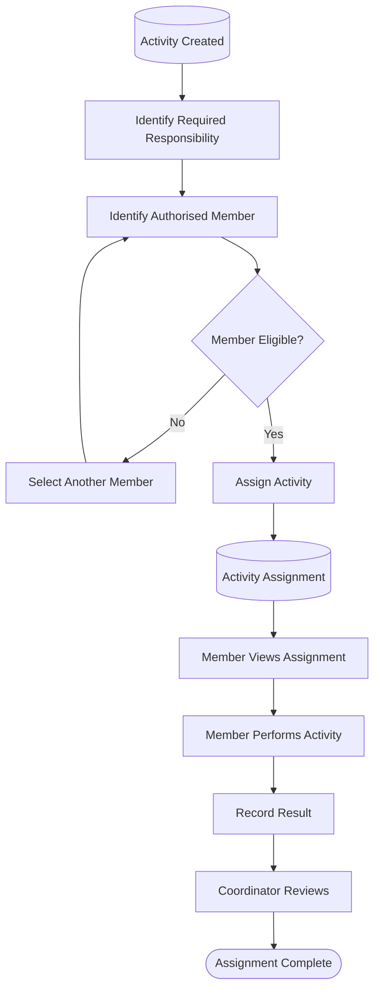

Members should not assign themselves activities unless they have explicit assignment permission.

# 14. Poultry Management Workflow

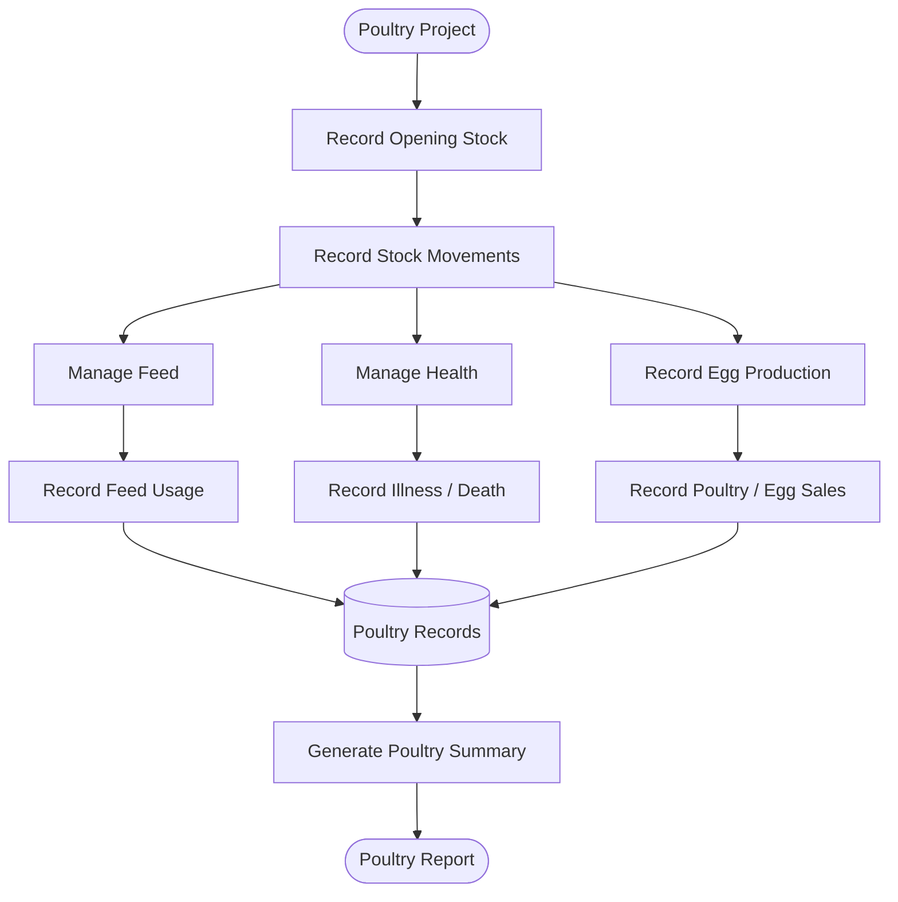

Poultry may initially support local chickens, Kienyeji chickens, future poultry categories, egg production, feed, health, deaths, sales, and other authorised stock movements.

# 15. Poultry Stock Workflow

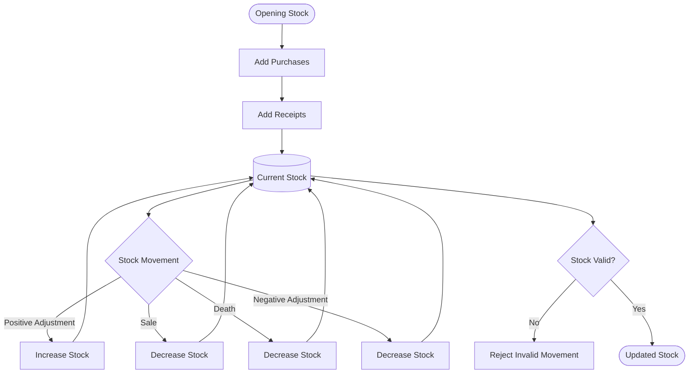

Conceptually:

**Current Stock = Opening Stock + Purchases + Receipts + Positive Adjustments - Sales - Deaths - Negative Adjustments**

The database should preserve the underlying stock movements.

# 16. Egg Production Workflow

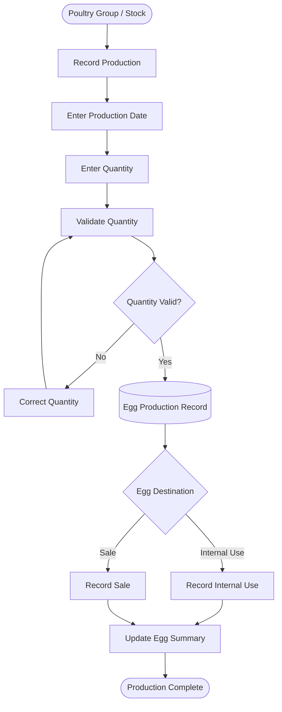

Egg quantities must not be negative.

# 17. Poultry Feed Workflow

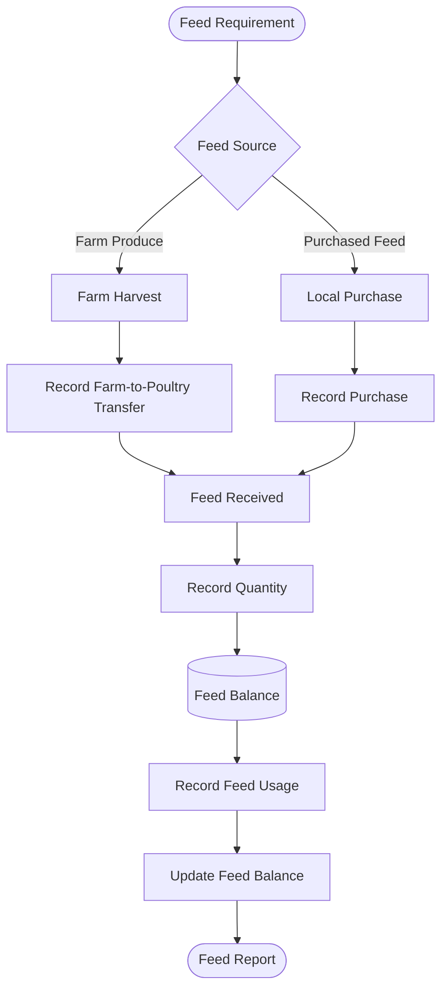

Farm-produced feed must be linked to the farm-to-poultry transfer workflow where applicable.

# 18. Poultry Health Workflow

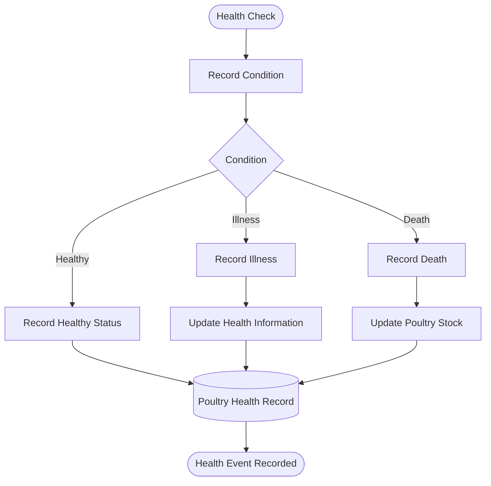

Poultry deaths must affect stock calculations.

# 19. Poultry Sales Workflow

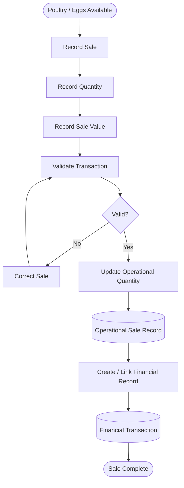

Operational quantities and financial records remain logically distinct.

# 20. Small Farm Workflow

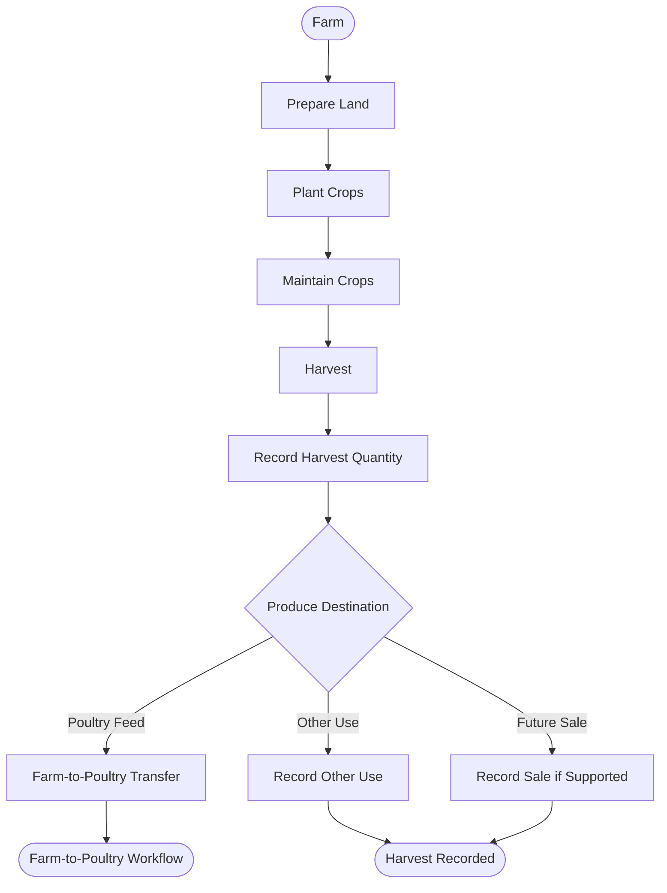

Initial crop examples include:

* Bananas
* Natural/local vegetables
* Sukuma wiki

# 21. Farm Activity Workflow

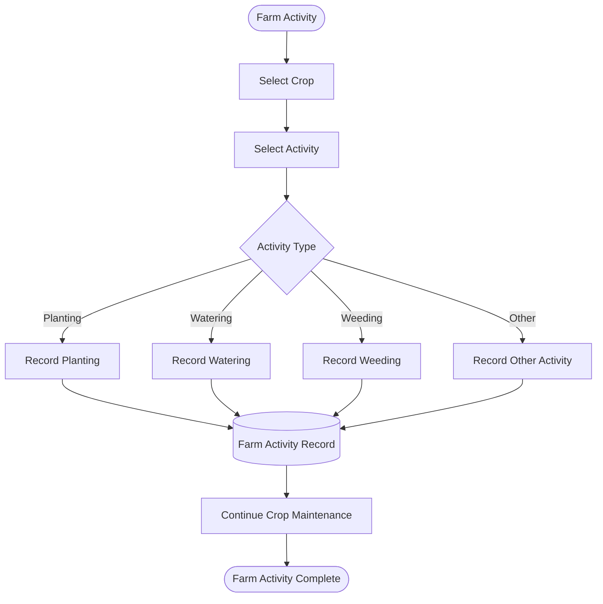

# 22. Farm-to-Poultry Transfer Workflow

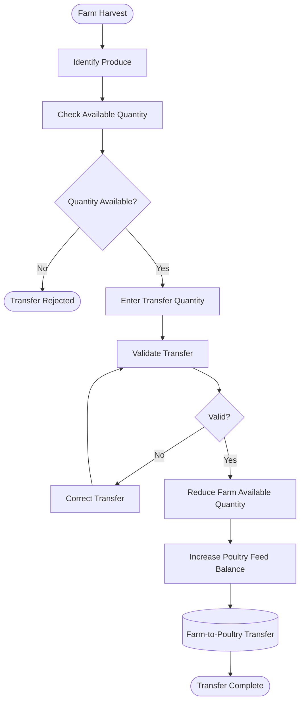

The transfer must preserve source, destination, date, quantity, responsible user, and related records.

# 23. Finance Workflow

ERA-IPMS initially provides basic financial management rather than full accounting.

```mermaid
flowchart TD
    A([Financial Event]) --> B{Transaction Type}

    B -->|Income / Sale| C[Record Income]
    B -->|Expense| D[Record Expense]

    C --> E[Select Category]
    D --> E

    E --> F[Enter Amount]
    F --> G[Enter Date and Description]
    G --> H[Link Project / Farm / Poultry if Applicable]
    H --> I[Validate Transaction]
    I --> J{Valid?}

    J -->|No| K[Correct Transaction]
    K --> I

    J -->|Yes| L[(Financial Transaction)]
    L --> M{Approval Required?}

    M -->|Yes| N([Finance Approval Workflow])
    M -->|No| O[Include in Financial Summary]

    N --> O
    O --> P([Financial Report])
```

Possible expense categories include project, poultry, farm, office, transport, equipment, and other.

# 24. Finance Approval Workflow

```mermaid
flowchart TD
    A([Transaction Created]) --> B[(Status: PENDING)]
    B --> C[Authorised Reviewer]
    C --> D{Decision}

    D -->|Approve| E[(Status: APPROVED)]
    D -->|Return| F[(Status: RETURNED)]
    D -->|Reject| G[(Status: REJECTED)]

    F --> H[Correct Transaction]
    H --> I[Resubmit]
    I --> B

    E --> J([Approved Financial Record])
    G --> K([Rejected Financial Record])
```

The exact approval requirements for different transaction types shall be confirmed during implementation.

# 25. Staff and Member Workflow

The system should distinguish a person's organisational record from their system account.

```mermaid
flowchart TD
    A([Person Joins ERA]) --> B[Create Staff / Member Record]
    B --> C[Record Organisational Information]
    C --> D[Assign Title]
    D --> E[Assign Responsibilities]
    E --> F[Assign Project / Activities]
    F --> G{System Account Required?}

    G -->|No| H([Organisational Record Only])
    G -->|Yes| I[Create System Account]
    I --> J[Assign Permissions]
    J --> K[Activate User]
    K --> L([User Ready])
```

# 26. User Access Change Workflow

```mermaid
flowchart TD
    A([Access Change Required]) --> B[Authorised Admin]
    B --> C[Review User]
    C --> D[Update Title / Responsibilities / Permissions]
    D --> E[Review Project Assignments]
    E --> F[Save Changes]
    F --> G[(Audit Event)]
    G --> H[New Access Takes Effect]
    H --> I([Access Updated])
```

Deactivated users must not retain normal authenticated access.

# 27. Monitoring and Evaluation Workflow

```mermaid
flowchart TD
    A[(Beneficiary Data)] --> E[Indicators]
    B[(Disability Services)] --> E
    C[(Home Visits / Referrals)] --> E
    D[(Project Activities)] --> E
    F[(Farm Data)] --> E
    G[(Poultry Data)] --> E
    H[(Relevant Financial Data)] --> E

    E --> I[Calculate Authorised Indicators]
    I --> J[Review M&E Information]
    J --> K[(M&E Summary)]
    K --> L([M&E Reports])
```

The initial system should support validated operational indicators. Advanced M&E functionality may be added later.

# 28. Dashboard Workflow

```mermaid
flowchart TD
    A[(Database)] --> B[Permission Check]
    B --> C[Retrieve Authorised Data]
    C --> D[Calculate / Aggregate]
    D --> E[Dashboard]

    E --> F[Programme View]
    E --> G[Poultry View]
    E --> H[Farm View]
    E --> I[Finance View]
    E --> J[M&E View]

    F --> K([Management Information])
    G --> K
    H --> K
    I --> K
    J --> K
```

Dashboard information must respect the user's permissions and record-level access.

# 29. Reporting Workflow

```mermaid
flowchart TD
    A([Authorised User]) --> B[Select Report]
    B --> C[Select Date / Filters]
    C --> D[Permission Check]
    D --> E[Retrieve Authorised Data]
    E --> F[Generate Report]
    F --> G{Output}

    G -->|View| H[Display Report]
    G -->|Export| I{Format}
    I -->|PDF| J[Generate PDF]
    I -->|Excel| K[Generate Excel]

    H --> L([Report Complete])
    J --> L
    K --> L
```

Reports and exports must not bypass record-level access restrictions.

# 30. Search and Filtering Workflow

```mermaid
flowchart TD
    A([User Opens Search]) --> B[Enter Search Criteria]
    B --> C[Apply Permission Rules]
    C --> D[Search Authorised Records]
    D --> E[Apply Filters]
    E --> F[Display Results]
    F --> G{Record Selected?}

    G -->|No| B
    G -->|Yes| H[Check Record Access]
    H --> I{Authorised?}

    I -->|Yes| J([Open Record])
    I -->|No| K([Access Denied])
```

Search must never become a method of bypassing access controls.

# 31. Notification Workflow

```mermaid
flowchart TD
    A([System Event]) --> B[Determine Notification Requirement]
    B --> C{Notification Required?}

    C -->|No| D([No Notification])
    C -->|Yes| E[Identify Authorised Recipient]
    E --> F[Create Notification]
    F --> G[(Notification)]
    G --> H[Display Notification]
    H --> I[User Opens Notification]
    I --> J[Check Record Access]
    J --> K{Authorised?}

    K -->|Yes| L([Open Related Record])
    K -->|No| M([Access Denied])
```

Possible notifications include pending referrals, follow-ups due, assigned activities, overdue activities, approval requests, and financial transactions requiring review.

# 32. Error and Correction Workflow

```mermaid
flowchart TD
    A([Record Created]) --> B[Record Reviewed]
    B --> C{Error Found?}

    C -->|No| D([Record Accepted])
    C -->|Yes| E[Check Edit Permission]
    E --> F{Edit Authorised?}

    F -->|No| G([Correction Denied])
    F -->|Yes| H[Edit Record]
    H --> I[Validate Correction]
    I --> J{Valid?}

    J -->|No| H
    J -->|Yes| K[(Updated Record)]
    K --> L[(Audit Event)]
    L --> M([Correction Complete])
```

Important records should retain information about who made corrections.

# 33. Data Validation Workflow

```mermaid
flowchart TD
    A([User Enters Data]) --> B[Required Field Check]
    B --> C[Data Type Check]
    C --> D[Business Rule Check]
    D --> E{All Validation Passed?}

    E -->|No| F[Display Validation Error]
    F --> G[Correct Data]
    G --> B

    E -->|Yes| H[(Save Record)]
    H --> I([Record Created / Updated])
```

Examples include required fields, valid dates, numeric values, financial amounts, non-negative quantities, valid stock movements, duplicate detection, and valid relationships.

# 34. Beneficiary Archive Workflow

Beneficiary records should normally not be physically deleted.

```mermaid
flowchart TD
    A[(Active Beneficiary)] --> B[Archive Required]
    B --> C[Authorised User]
    C --> D[Confirm Archive]
    D --> E{Archive Authorised?}

    E -->|No| F([Archive Denied])
    E -->|Yes| G[(Status: INACTIVE / ARCHIVED)]
    G --> H[Exclude from Normal Active Lists]
    H --> I([Record Retained])
```

Archived records may remain accessible to authorised users.

Restoration should require appropriate permission.

# 35. Audit Workflow

```mermaid
flowchart TD
    A([User Action]) --> B[Permission Check]
    B --> C{Action Authorised?}

    C -->|No| D([Action Denied])
    C -->|Yes| E[Execute Action]
    E --> F[(Record Changed)]
    F --> G[Create Audit Event]
    G --> H[(Audit Log)]
    H --> I([Action Complete])
```

Audit information may include:

* User.
* Action.
* Module.
* Record.
* Date and time.
* Previous value where appropriate.
* New value where appropriate.
* Project context.

# 36. Record-Level Access Workflow

```mermaid
flowchart TD
    A([User Requests Record]) --> B{Authenticated?}
    B -->|No| C([Access Denied])
    B -->|Yes| D{Permission Available?}

    D -->|No| C
    D -->|Yes| E[Check Responsibility]
    E --> F{Within Responsibility?}

    F -->|No| C
    F -->|Yes| G[Check Project / Activity Scope]
    G --> H{Within Scope?}

    H -->|No| C
    H -->|Yes| I[Check Ownership / Relationship]
    I --> J{Record Accessible?}

    J -->|No| C
    J -->|Yes| K([Display Authorised Record])
```

This is particularly important for beneficiary, disability, home visit, referral, follow-up, project, financial, and staff records.

# 37. End-to-End Beneficiary Service Workflow

```mermaid
flowchart TD
    A([Person Identified]) --> B[Search Beneficiary]
    B --> C{Existing?}

    C -->|Yes| D[Open Beneficiary]
    C -->|No| E[Register Beneficiary]

    D --> F[Assessment]
    E --> F

    F --> G[Identify Needs]
    G --> H{Referral Required?}

    H -->|No| I[Provide / Record Direct Support]
    H -->|Yes| J[Create Referral]
    J --> K[Submit Referral]
    K --> L[Authorised Approval]
    L --> M{Approved?}

    M -->|No| N[Return / Correct Referral]
    N --> J

    M -->|Yes| O[Referral Action]
    O --> P[Follow-Up]

    I --> Q[Home Visit if Required]
    P --> Q
    Q --> R[Record Outcome]
    R --> S[Update Service Record]
    S --> T([Monitor / Report])
```

# 38. End-to-End Project Workflow

```mermaid
flowchart TD
    A([Project Proposal]) --> B[Project Creation]
    B --> C[Objectives / Scope]
    C --> D[Activity Planning]
    D --> E[Activity Assignment]
    E --> F[Implementation]
    F --> G[Record Results]
    G --> H[Project Monitoring]
    H --> I[M&E]
    I --> J[Reporting]
    J --> K[Management Review]

    K --> L{Project Decision}
    L -->|Continue| F
    L -->|Modify| D
    L -->|Complete| M([Project Completed])
    L -->|Close| N([Project Closed])
```

# 39. End-to-End Farm and Poultry Workflow

```mermaid
flowchart TD
    A([Small Farm]) --> B[Plant / Maintain]
    B --> C[Harvest]
    C --> D[Record Harvest]
    D --> E{Use of Produce}

    E -->|Poultry Feed| F[Farm-to-Poultry Transfer]
    E -->|Other Use| G[Other Farm Use]
    E -->|Sale| H[Farm Sale]

    F --> I[Poultry Feed Balance]
    I --> J[Feed Usage]
    J --> K[Poultry]

    K --> L[Egg Production]
    K --> M[Health / Stock Management]

    L --> N[Egg Sale / Use]
    M --> O[Poultry Sale / Deaths]

    H --> P[Financial Record]
    N --> P
    O --> P

    P --> Q([Finance / Reports / M&E])
```

# 40. End-to-End Finance Workflow

```mermaid
flowchart TD
    A([Project / Farm / Poultry / Office Event]) --> B[Financial Transaction]
    B --> C{Transaction Type}

    C -->|Income| D[Record Income]
    C -->|Sale| E[Record Sale]
    C -->|Expense| F[Record Expense]

    D --> G[Categorise]
    E --> G
    F --> G

    G --> H[Validate]
    H --> I{Valid?}

    I -->|No| J[Correct]
    J --> H

    I -->|Yes| K[(Financial Record)]
    K --> L{Approval Required?}

    L -->|Yes| M[Approval Workflow]
    L -->|No| N[Financial Summary]

    M --> N
    N --> O([Financial Report])
```

# 41. Overall ERA-IPMS Information Flow

```mermaid
flowchart TD
    A([ERA-IPMS]) --> B[Disability Services]
    A --> C[Projects and Activities]
    A --> D[Farm and Poultry]
    A --> E[Finance]

    B --> F[(Beneficiary / Service Records)]
    C --> G[(Project / Activity Records)]
    D --> H[(Farm / Poultry Records)]
    E --> I[(Financial Records)]

    F --> J[M&E]
    G --> J
    H --> J
    I --> J

    J --> K[Dashboard]
    J --> L[Reports]

    K --> M([Management Information])
    L --> M

    M --> N([Management Review])
    N --> O([Decision-Making])
```

# 42. Workflow Status and State Management

The system should use controlled statuses rather than relying on free-text descriptions.

### Referral

```mermaid
stateDiagram-v2
    [*] --> Pending
    Pending --> Submitted
    Submitted --> Approved
    Submitted --> Returned
    Returned --> Submitted
    Approved --> InProgress
    InProgress --> Completed
    InProgress --> Cancelled
    Completed --> Closed
```

### Activity

```mermaid
stateDiagram-v2
    [*] --> Planned
    Planned --> Ongoing
    Ongoing --> Pending
    Pending --> Completed
    Planned --> Cancelled
    Ongoing --> Cancelled
    Pending --> Ongoing
```

### Beneficiary

```mermaid
stateDiagram-v2
    [*] --> Active
    Active --> Inactive
    Active --> Archived
    Inactive --> Active
    Archived --> Active
```

### Project

Initial project statuses should be confirmed during database design.

Possible states include:

```mermaid
stateDiagram-v2
    [*] --> Draft
    Draft --> Active
    Active --> OnHold
    OnHold --> Active
    Active --> Completed
    Active --> Cancelled
    Completed --> Closed
    Cancelled --> Closed
```

Final status values must remain consistent across requirements, workflows, database design, and application implementation.

# 43. Workflow Security Rules

All workflows shall observe the following:

1. Authentication is required for protected functions.
2. Permissions are checked before protected actions.
3. Record-level access is enforced by the backend.
4. Financial records are restricted to authorised users.
5. Beneficiary information is protected.
6. Approval is separate from creation where required.
7. Deactivated users cannot access protected functions.
8. Important changes should be auditable.
9. Users cannot bypass permissions through direct URLs or crafted requests.
10. Exports must respect the same access restrictions as normal views.

# 44. Workflow-to-Title Responsibilities

| Workflow Area         | Admin      | Director                 | Programme Coordinator | Finance        | Member                           |
| --------------------- | ---------- | ------------------------ | --------------------- | -------------- | -------------------------------- |
| Authentication        | Administer | Use                      | Use                   | Use            | Use                              |
| User Access           | Manage     | No                       | No                    | No             | No                               |
| Beneficiary Services  | Authorised | Review                   | Coordinate            | No             | Assigned Responsibility          |
| Referrals             | Authorised | Approve where authorised | Review / Manage       | No             | Create / Submit where authorised |
| Projects              | Manage     | Manage / Oversight       | Manage                | View Relevant  | Assigned                         |
| Activities            | Manage     | Oversight                | Manage                | View Relevant  | Assigned                         |
| Poultry               | Authorised | Review                   | Review                | Financial      | Operational                      |
| Farm                  | Authorised | Review                   | Review                | Financial      | Operational                      |
| Finance               | Authorised | Oversight                | Authorised View       | Manage         | Not by Default                   |
| M&E                   | Authorised | Oversight                | Programme             | Financial View | Operational Data                 |
| Reports               | Authorised | Generate                 | Generate              | Financial      | Limited                          |
| System Administration | Administer | No                       | No                    | No             | No                               |

The exact action-level permissions remain governed by the User Roles and Permissions document.

# 45. MVP Workflow Scope

The initial MVP should prioritise:

1. Authentication.
2. User access control.
3. Beneficiary registration.
4. Disability assessments.
5. Home visits.
6. Referrals.
7. Referral follow-ups.
8. Projects.
9. Activities.
10. Poultry records.
11. Poultry stock.
12. Egg production.
13. Poultry feed.
14. Farm activities.
15. Farm harvests.
16. Farm-to-poultry transfers.
17. Basic finance.
18. Staff and Member records.
19. Basic M&E.
20. Dashboard.
21. Basic reporting.
22. Search and filtering.
23. Audit information.
24. Data validation.

Advanced integrations, offline functionality, sophisticated notifications, advanced analytics, and external partner access remain future scope unless formally promoted into the MVP requirements.

# 46. Workflow Dependencies

```mermaid
flowchart TD
    A[(User)] --> B[Title / Permissions / Responsibilities]
    B --> C[Project / Activity Assignment]
    C --> D[(Operational Record)]
    D --> E[(Audit Event)]
```

```mermaid
flowchart TD
    A[(Beneficiary)] --> B[Assessment]
    B --> C[Home Visit]
    C --> D[Referral]
    D --> E[Follow-Up]
    E --> F[Outcome]
```

```mermaid
flowchart TD
    A[(Farm)] --> B[Harvest]
    B --> C[Farm-to-Poultry Transfer]
    C --> D[Poultry Feed]
    D --> E[Feed Usage]
```

```mermaid
flowchart TD
    A[(Poultry)] --> B[Egg Production]
    B --> C[Egg Sale]
    C --> D[(Financial Record)]
```

```mermaid
flowchart TD
    A[(Project)] --> B[Activities]
    B --> C[Operational Results]
    C --> D[M&E]
    D --> E[Reports]
```

These dependencies will be used to validate the database entity design.

# 47. Outstanding Validation Points

Before implementation, ERA should validate:

1. Exact referral approval authority.
2. Exact project approval authority.
3. Exact financial approval requirements.
4. Final referral statuses.
5. Final project statuses.
6. Final activity statuses.
7. Whether all financial transactions require approval.
8. Whether Members can edit records after submission.
9. Who can archive beneficiary records.
10. Whether archived records can be restored.
11. Exact M&E indicators for the initial release.
12. Exact report list for the MVP.
13. Whether notifications are MVP or post-MVP.
14. Exact project and activity assignment rules.

These are workflow validation items, not reasons to introduce undocumented assumptions into the application.

# 48. Relationship to Database Design

The workflows identify the business processes that the database must support.

The next database-design stage should identify entities and relationships required to represent:

* Users.
* Titles.
* Permissions.
* Responsibilities.
* User assignments.
* Beneficiaries.
* Disability records.
* Home visits.
* Referrals.
* Referral follow-ups.
* Projects.
* Activities.
* Activity assignments.
* Poultry groups.
* Poultry stock movements.
* Egg production.
* Feed.
* Poultry health events.
* Farm crops.
* Farm activities.
* Harvests.
* Farm-to-poultry transfers.
* Financial transactions.
* Staff and Members.
* M&E indicators.
* Audit events.

No database table should be introduced solely because it appears convenient in code. It should trace back to an approved requirement or workflow.

# 49. Conclusion

The ERA-IPMS workflow model connects beneficiary services, projects, activities, poultry, farm operations, finance, M&E, dashboards, and reporting into one controlled information system.

The workflow model is based on the approved five-title architecture:

1. Admin.
2. Director.
3. Programme Coordinator.
4. Finance.
5. Member.

Titles, permissions, responsibilities, project assignments, and record-level access are treated as separate concepts.

The workflows distinguish data entry from approval, operational quantities from financial transactions, and technical administration from programme authority.

The diagrams in this document provide a visual representation of each major workflow and will serve as a bridge between the requirements baseline and the database/entity design.

Before database implementation begins, the workflow rules should be reviewed against the actual ERA operating procedures and any unresolved validation points should be documented rather than assumed.

This document provides the workflow baseline for the next stage: **Database Entity Design**.
